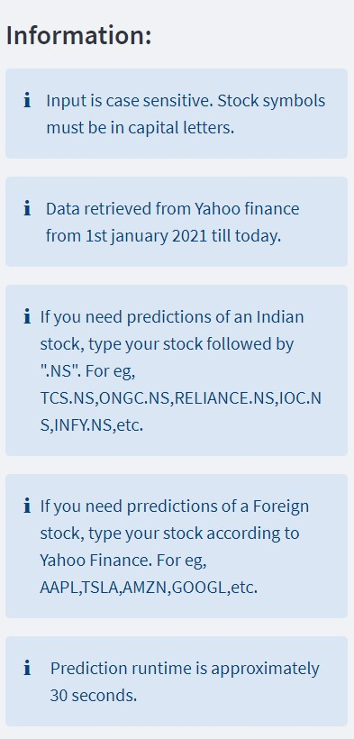
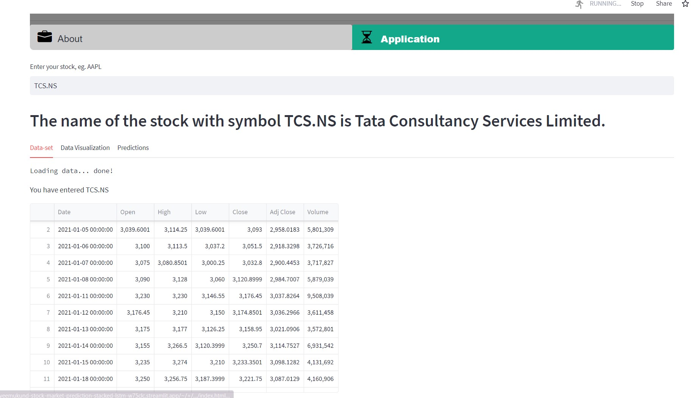
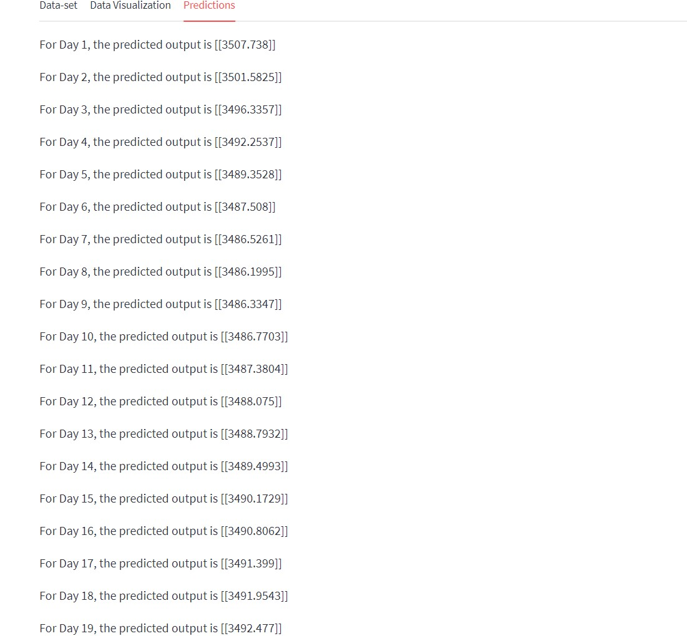

# Stock Market Prediction Streamlit app using Stacked LSTM


## View this in action
Using [streamlit](https://streamlit.io) to show the [Stock market prediction](https://c19sitdash.azurewebsites.net/) based on real time [](https://sayeemukund-stock-market-prediction-stacked-lstm-w75clc.streamlit.app/)

## App in a Glance








## Code execution

Ensure all dependencies are installed

```console
pip install -r requirements.txt
```

Run this command

```console
streamlit run path/to/stock1.py
```

To update requirements.txt, navigate to folder containing stock1.py and execute the following

```console
python -m pigar -p .\requirements.txt
```
